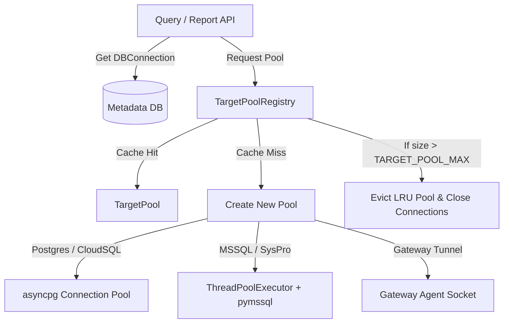
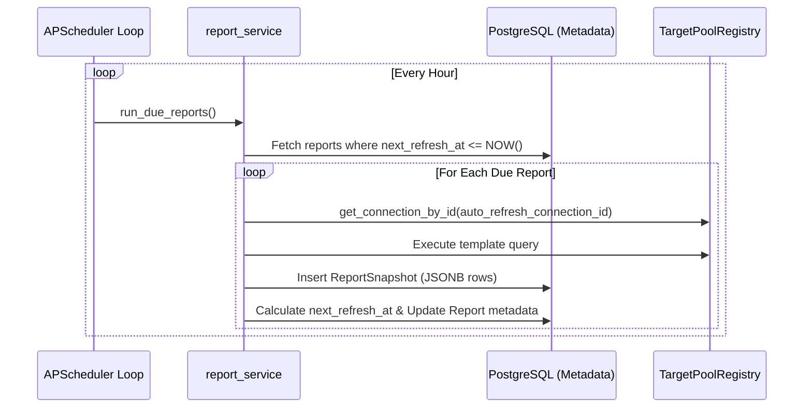

# 15 — Data Execution, Gateway Agent, & Scheduler Architecture

This document details the deep engineering flows of the Repnex backend, covering:
1. **Database Connections & TargetPool Architecture** (LRU caching, thread pools, and runtime SQL dialect translation)
2. **Secure Gateway Agent Tunneling Protocol** (WebSocket tunnels, systemd/Windows scheduling, and query routing)
3. **Template-Driven Query Execution Lifecycle** (NL classification, Pinecone retrieval, parameter validation, and streaming)
4. **Scheduled Report Auto-Refresh & Snapshots** (APScheduler background loop, system-level bypass, and historical snapshots)

---

## 1. Database Connections & TargetPool Architecture

Repnex connects directly to customers' target databases (PostgreSQL, CloudSQL, MSSQL, etc.). Opening and closing database connections on every request would degrade query performance and risk exhausting the target database's connection limits. 

To solve this, Repnex uses a custom **LRU-cached Connection Pool Registry** (`TargetPoolRegistry`) located in `app/core/database/target_pool.py`.



### LRU Connection Pooling Cache
- **`TargetPoolRegistry`**: Holds an `OrderedDict` mapping `connection_id` (UUID) to `TargetPool` objects.
- **Eviction Strategy**: When a connection is requested, it is moved to the end of the cache. If the registry exceeds `TARGET_POOL_MAX`, the least-recently-used pool is popped and its underlying resources are closed.
- **Thread Safety**: Access is guarded by an `asyncio.Lock` to prevent concurrent requests from establishing duplicate pools for the same database.

### Sync Driver Wrapping (MSSQL & ThreadPoolExecutor)
While PostgreSQL/CloudSQL queries are executed fully asynchronously using `asyncpg`, MSSQL/SysPro connection relies on the pure-Python `pymssql` driver (a synchronous library). To prevent long-running queries from blocking the main FastAPI event loop:
1. MSSQL executions are dispatched to a dedicated background `ThreadPoolExecutor` (`_MSSQL_EXECUTOR`).
2. The number of worker threads is configured via the `MSSQL_POOL_WORKERS` environment variable.
3. Queries are wrapped inside `asyncio.wait_for` to enforce strict query timeout boundaries.

---

## 2. Secure Gateway Agent Tunneling Protocol

For enterprise customers with local databases (such as ERP databases hosted behind corporate firewalls), opening ports is not permitted. Repnex uses a **Reverse WebSocket Tunneling Protocol** to route queries.

```
┌──────────────────────────────────────┐                   ┌──────────────────────────────────────┐
│            REPNEX CLOUD              │                   │          ON-PREMISE NETWORK          │
│                                      │                   │                                      │
│  ┌────────────────────────────────┐  │   Secure WS Port  │  ┌────────────────────────────────┐  │
│  │         GatewayManager         │  │   (Outbound-Only) │  │      repnex-agent.py           │  │
│  │  Manages active agent sockets  │◄─┼───────────────────┼──┤  Establishes WebSocket tunnel  │  │
│  └────────────────┬───────────────┘  │                   │  └───────────────┬────────────────┘  │
│                   │                  │                   │                  │ Local connection  │
│                   ▼ Dispatch Query   │                   │                  ▼                   │
│  ┌────────────────────────────────┐  │                   │  ┌────────────────────────────────┐  │
│  │   JSON query request payload   │──┼───────────────────┼─→│   Executes query on local DB   │  │
│  │   (sql, params, query_id)      │  │                   │  │   (Returns JSON response payload)  │  │
│  └────────────────────────────────┘  │                   │  └────────────────────────────────┘  │
└──────────────────────────────────────┘                   └──────────────────────────────────────┘
```

### Protocol Handshake & Connection Loop
1. **Outbound Registration**: The agent initiates an outbound connection to `ws://[server]/api/v1/ws/gateway` passing the user's JWT access token and a unique `--agent-name`.
2. **Gateway Registry**: The backend `GatewayManager` extracts the `org_id` from the JWT token and registers the active WebSocket socket under the key `{org_id}:{agent_name}`.
3. **Heartbeat Protocol**: The WebSocket connection is configured with active ping/pong intervals to prune dead TCP connections and trigger automatic reconnect routines on the agent.

### Query Routing & Request-Response Matching
When a query is dispatched to a gateway-configured connection:
1. The `TargetPool` detects the host begins with `gateway:`.
2. It generates a unique `query_id` (UUID) and registers an `asyncio.Future` in the `GatewayManager._pending_queries` registry.
3. The query is serialized into a JSON packet and sent over the WebSocket:
   ```json
   {
     "action": "query",
     "query_id": "8b51d8b7-4c28-444f-9556-9a2cf1114b0b",
     "sql": "SELECT customer_name, balance FROM ar_customers WHERE balance > %s",
     "params": [5000],
     "db_name": "SysproCompanyA",
     "db_type": "mssql"
   }
   ```
4. The local agent receives the JSON packet, runs the query against the target database, formats dates/numbers to standard formats, and returns:
   ```json
   {
     "action": "query_response",
     "query_id": "8b51d8b7-4c28-444f-9556-9a2cf1114b0b",
     "status": "success",
     "data": [{"customer_name": "Acme Corp", "balance": 7450.0}]
   }
   ```
5. `GatewayManager` matches the incoming payload's `query_id`, resolves the waiting `asyncio.Future`, and passes the data block back to the query engine pipeline.

---

## 3. Template-Driven Query Execution Lifecycle

Repnex enforces **Parameterized Template-Only Execution** to protect tenant databases. The AI model is strictly prohibited from writing raw SQL. Instead, it acts as an intent-routing engine that maps prompts to predefined templates and extracts parameters.

```
[ User Prompt ] 
       │ (e.g. "Who are my top 5 customers?")
       ▼
[ Intent Classifier ] ──> Conversational Response?
       │ No
       ▼
[ RAG / Pinecone Template Search ]
       │ Matches template "top_customers_by_revenue" (Confidence >= 0.8)
       ▼
[ Parameter Binder ]
       ├─ Coerces and validates parameters (e.g. limit=5)
       └─ Translates query dialect and binds placeholders
               │
               ▼
[ TargetPool Execution ] ──> Streams rows back in batches
```

### Dialect Adaptations in `template_loader.py`
Many pre-curated query templates are authored using Microsoft SQL Server syntax (e.g. utilizing `SELECT TOP`, `GETDATE()`, etc.). If a connection's `db_type` is PostgreSQL or CloudSQL, the template loader adapts the SQL statements dynamically using regular expression translation rules:

| SQL Dialect Source (MSSQL) | Dynamic Adaptations (PostgreSQL / CloudSQL) |
|-----------------------------|---------------------------------------------|
| `SELECT TOP %(limit)s ...`  | Appends `LIMIT %(limit)s` to the query      |
| `GETDATE()`                 | Rewrites to `CURRENT_DATE`                  |
| `DATEDIFF(day, colA, colB)` | Rewrites to `((colB) - (colA))`             |
| `ISNULL(colA, colB)`        | Rewrites to `COALESCE(colA, colB)`          |

### Parameter Extraction & Safe Binding
The template parameters undergo validation in `parameter_binder.py` against the template's JSON schema:
1. **Type Casts**: Values are coerced to their specified types (`int`, `float`, `string`, `bool`, `date`, or `enum`).
2. **Constraint Validation**: Integer/float values must satisfy range constraints (e.g. `min`/`max`). String arguments are matched against regex patterns.
3. **Driver Conversions**: SQL template variables formatted as `%(parameter)s` are converted to driver-specific placeholders:
   - **PostgreSQL**: Translated to positional arguments (`$1`, `$2`, ...)
   - **MSSQL**: Translated to positional tokens (`%s` or `?`)
   
> [!IMPORTANT]
> Because variables are bound strictly through driver-level parameters (e.g. using `asyncpg` prepared statements or `pymssql` parameters), SQL injection is structurally impossible.

---

## 4. Scheduled Report Auto-Refresh & Snapshots

To provide automated time-series data availability, Repnex supports recurring scheduled background executions.



### APScheduler Background Scheduler Integration
- **Lifespan Manager**: The task scheduler is instantiated within FastAPI's lifespan configuration (`app/main.py`) using `AsyncIOScheduler`.
- **Hourly Execution**: A cron trigger runs `report_service.run_due_reports` every hour to locate reports that are due.
- **Trigger Window**: Reports are identified by querying the database for rows where:
  - `refresh_interval_days > 0`
  - `next_refresh_at <= NOW()`
  - `auto_refresh_connection_id` is configured

### System-Level Connection Retrieval Bypass
Standard API requests are wrapped in security dependencies that extract tenant context (`TenantCtx`) from user session headers. However, because the background scheduler runs outside the scope of an HTTP request, it lacks a `CurrentUser` context. 

To bridge this, `connection_service.py` implements a system-level bypass:
- **`get_connection_by_id(db_session, connection_id)`**: Fetches connection parameters and decrypts credentials directly using system authority, bypasses tenant context checks, but strictly limits access to the target report's matching connection record.

### Snapshots Storage Strategy
Each report run creates a `ReportSnapshot` entry.
- **Schema**:
  ```sql
  CREATE TABLE report_snapshots (
      id UUID PRIMARY KEY,
      report_id UUID REFERENCES reports(id) ON DELETE CASCADE,
      run_status VARCHAR(32) NOT NULL, -- 'success' or 'error'
      rows_returned INT DEFAULT 0,
      execution_time_ms INT DEFAULT 0,
      raw_data JSONB NOT NULL DEFAULT '[]', -- Full query result set
      error_message TEXT NULL,
      created_at TIMESTAMPTZ DEFAULT NOW()
  );
  ```
- **JSONB Optimization**: The query results are serialized as JSON and stored inside the `raw_data` column. This enables schema flexibility, allowing reports with different columns and shapes to share a single snapshot table.
