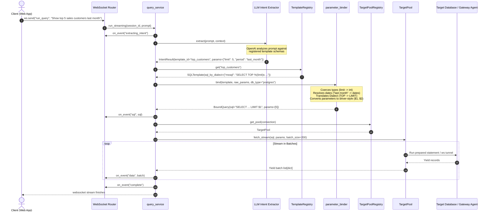

# 10 — Template-Driven Query Execution Deep Dive

Repnex executes user queries using a strict **Template-Driven Architecture**. The AI model (OpenAI) is never allowed to write raw SQL directly. Instead, it classifies intent, selects a vetted template, and extracts parameters.

This document details the complete end-to-end flow of how a natural language prompt is routed, validated, adapted, and executed against a customer's database.

---

## 1. End-to-End Execution Sequence

The following diagram maps the lifecycle of a query from the user's browser, through the FastAPI gateway, down to the database connection pool (or secure Gateway agent tunnel), and back.



---

## 2. Step 1: Intent Routing & Template Matching

When a natural language query is received:
1. **Context Context Loading**: `query_service` retrieves the session's chat history context window (last N messages) to support pronoun resolution (e.g., "what about last month?").
2. **LLM Dispatch**: The prompt and context are sent to the `intent_extractor` (`app/llm/intent_extractor.py`) with `temperature=0.0` to force deterministic classification.
3. **Structured Selection**: The system prompt contains a dynamically rendered JSON array of all registered template schemas (names, parameter types, bounds, descriptions).
4. **LLM Output Constraint**: The LLM must respond with a strict JSON schema conforming to `IntentResult`:
   ```json
   {
     "template_id": "top_customers_by_revenue",
     "params": {
       "limit": 5,
       "start_date": "last month"
     },
     "confidence": 0.95,
     "reasoning": "User requested top 5 customers and specified last month."
   }
   ```

---

## 3. Step 2: Parameter Resolution & Coercion

Once the intent is classified, `parameter_binder.py` sanitizes and coerces the parameters:

### Natural Date Parsing
Before type coercion, natural language date strings are converted to explicit dates in `_resolve_natural_dates()`:
- `"last month"` $\rightarrow$ `(today - 30 days, today)`
- `"last quarter"` $\rightarrow$ `(today - 90 days, today)`
- `"ytd"` / `"this year"` $\rightarrow$ `(January 1st of current year, today)`

### Validation & Coercion Rules
For each parameter defined in the template schema:
- **Missing Check**: If a required parameter is missing and has no default, it raises a `ValidationFailed` error.
- **Type Coercion**:
  - `int`: Converts value to integer. Verifies `min` and `max` limits.
  - `float`: Coerces to float.
  - `enum`: Assures value is in the template's specified whitelist.
  - `date` / `datetime`: Parses ISO 8601 strings into datetime objects.
  - `bool`: Parses `"true"`, `"1"`, `"yes"` $\rightarrow$ `True`.
- **Derived Parameters**: Calculated timeframes are updated automatically if the template requires `start` and `end` date parameters.

---

## 4. Step 3: Dialect translation

Often, templates are authored in MS SQL Server format. To avoid maintaining separate queries for every database type, the `SQLTemplate` class adapts dialect elements on-the-fly depending on the target database type:

```python
# app/query_engine/template_loader.py
# If target db is postgres/cloudsql and we fallback to MSSQL SQL, adapt it
```

### Translation Rules

1. **`SELECT TOP` $\rightarrow$ `LIMIT`**:
   - MSSQL: `SELECT TOP %(limit)s customer_id, name FROM customers`
   - Postgres: `SELECT customer_id, name FROM customers LIMIT %(limit)s`
2. **`GETDATE()` $\rightarrow$ `CURRENT_DATE`**:
   - MSSQL: `SELECT * FROM orders WHERE order_date >= GETDATE() - 30`
   - Postgres: `SELECT * FROM orders WHERE order_date >= CURRENT_DATE - 30`
3. **`DATEDIFF` $\rightarrow$ Date subtraction**:
   - MSSQL: `DATEDIFF(day, created_at, updated_at)`
   - Postgres: `((updated_at) - (created_at))`
4. **`ISNULL` $\rightarrow$ `COALESCE`**:
   - MSSQL: `ISNULL(sales_amount, 0)`
   - Postgres: `COALESCE(sales_amount, 0)`

---

## 5. Step 4: Driver-Specific Placeholder Conversion

Different database drivers utilize different syntax for bound query parameters. The parameter binder converts pythonic dict style placeholders `%(parameter)s` to driver-specific tokens:

### PostgreSQL (`asyncpg`)
Positional placeholders (`$1, $2, ...`) are generated:
- **Input SQL**: `SELECT * FROM customers WHERE region = %(region)s LIMIT %(limit)s`
- **Output SQL**: `SELECT * FROM customers WHERE region = $1 LIMIT $2`
- **Parameters**: `["APAC", 5]`

### MSSQL (`pymssql`)
Positional placeholders (`%s`) are generated:
- **Input SQL**: `SELECT * FROM customers WHERE region = %(region)s`
- **Output SQL**: `SELECT * FROM customers WHERE region = %s`
- **Parameters**: `("APAC",)`

---

## 6. Step 5: Streaming Query Execution

The query execution phase runs the converted SQL statement through `TargetPool.fetch_stream()` to yield batches of row data asynchronously:

```python
async for batch in pool.fetch_stream(sql, params, batch_size=200, timeout=30):
    # Process batch rows (list[dict])
```

### Driver-Level Mechanics

#### 1. PostgreSQL/CloudSQL (Asyncpg server-side cursor)
To prevent memory spikes when retrieving large datasets:
- **Preparation**: Prepares a statement using `connection.prepare(sql)`.
- **Transaction**: Opens an explicit transaction wrapper.
- **Cursor**: Uses `connection.cursor(*params, prefetch=batch_size)` to stream records from the database in batches without pulling the entire result set into memory at once.

#### 2. MSSQL/SysPro (Sync Thread-Pool Execution)
Because `pymssql` is synchronous, queries are offloaded:
- **Background Dispatch**: Runs inside `asyncio.wait_for(loop.run_in_executor(_MSSQL_EXECUTOR, _run_sync))` to keep the event loop non-blocking.
- **Column Fallbacks**: Automatically names unnamed or calculated fields (e.g., `SUM(amount)`) as `column_0`, `column_1`, etc., to avoid dictionary key collision errors.
- **Batching**: Retrieves rows in batches using `cursor.fetchmany(batch_size)`.

#### 3. Gateway Agent WebSocket Tunneling
If the database host matches `gateway:*`:
- **Dispatches via WebSocket**: Serializes query variables and dispatches the request payload over the active agent WebSocket connection.
- **Future Hooks**: Registers a unique `query_id` future in `GatewayManager._pending_queries`.
- **Resolves Results**: Yields batches back once the agent executes the query locally and returns the response block.

---

## 7. Security Defenses

By combining parameter template-matching, validation, and parameter binding:
- **Zero SQL Injection Risk**: Parameters are bound by the driver database engine via server-side execution variables. String interpolation of user parameters is mathematically impossible.
- **Resource Protection**: Row counts are capped at `EXECUTOR_MAX_ROWS` (default: 5000), and execution timeout parameters are enforced at the driver socket level to prevent database locking/DDoS issues.
- **Read-Only Enforcement**: The `TemplateRegistry` analyzes statements, ensuring queries start exclusively with `SELECT` or `WITH` Common Table Expressions (CTEs), and rejects any query containing modification keywords (`INSERT`, `UPDATE`, `DELETE`, `DROP`, etc.).
